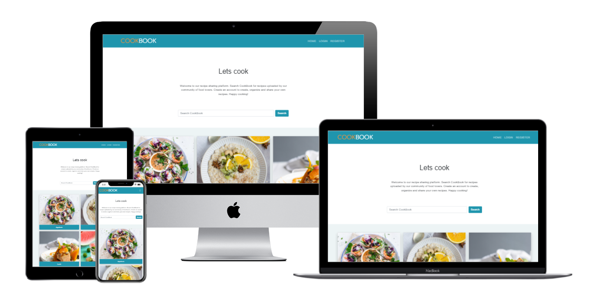

# CookBook

[View deployed site here](https://paolas-cookbook.herokuapp.com/)

CookBook is an online platform where food lovers can browse recipes (which are organised in different categories) and share their own recipes with the community. Non registered users have access to all the content that has been made public by the creators. Registered users can create and update recipes, leave comments and likes on the different posts, add other creators' recipes to their favourites and have access to a "personal" section where their own recipes will be organised.

## UX
---

### The ideal client for this website: 

- Speaks English.
- Likes food.
- Likes sharing content with others. 

### Visitors to this website are searching for: 

- New recipes to make.
- A website to store and organise all their recipes.
- A website to share their recipes with others.  

### User stories

1. As an Admin User I want to be able to add new recipe categories so that Site Users can better organise their recipes.
2. As an Admin User I can delete recipe posts so that I can manage the site content and make sure it is appropriate.
3. As an Admin User I can delete comments so that inappropriate comments can be removed.
4. As a Site User I want to be able to have recipes organised in different categories so that I can find what I am looking for more easily.      
5. As a Site User I want to be able to view a list of recipes so that I can select which one to open and view.
6. As a Site User I want to be able to open a specific recipe so that I can view the details, such as ingredients and intructions.
7. As a Site User I want to be able to view the likes of a recipe post so that I can see which recipes are more popular. 
8. As a Site User I want to be able to view the comments of a recipe post so that I can see the conversation.
9. As a Site / Admin User I want to be able to search for a recipe so that I can easily find it. 
10. As a Site User I want to be able to log into my account so that I can see both the public recipes shared by the community and my own personal recipes. 
11. As a Site User I can create a new recipe post so that it is added to my personal recipes.
12. As a Site User I can edit or delete my recipe posts so that I can manage my own content.  
13. As a Site User I can make my recipe posts public so that they are shared with the community and can be viewed by other users. 
14. As a Site User I want to be able to leave comments on a recipe post so that I can be part of the conversation.
15. As a Site user I want to be able to like/unlike a recipe so that I can interact with the shared content. 
16. As a Site User I want to be able to save a recipe I like into my favourites section so that I can have easy access to it.

### Wireframe mockups

[Desktop Mockups](readme-images/desktop-wireframes)

[Tablet Mockups](readme-images/tablet-wireframes)

[Mobile Mockups](readme-images/mobile-wireframes)

## Features
---

The header of each page features the website logo and the navigation menu. By clicking on the logo the user is redirected to the home page as it would be expected. The navigation menu is responsive and collapses into a burger menu in smaller screens. The navigation menu shows the following options for non authenticated users: "home," "login", "register". Authenticated users will see: "home", "favourites", "logout".
The footer on each page features links to social media pages and the copyright info.

### Home Page

#### Non authenticated users

The content of the home page is divided into two main sections. The first section, on top of the page, is a welcome message and a short introduction to the website with a call to action. Users are invited to create an account to have access to the additional feautures. Just below the welcome message, there is a search bar that allows to search for existing recipes. By clicking on "search", the user is redirected to the search_results page. 
The second section of the page contains a list of food categories organised in a grid of cards. By clicking on each card, the user will be redirected to public_recipes page that is listing all the available recipes for the category selected. Only the recipes that have been made public by the creators will be visible.  

#### Authenticated users

Authenticated users will see the same content as non registered users but with the following differences: 
- The message in the welcome section changes and now contains a greeting for the user. We also have a different call to action. Users are invited to create a new recipe by clicking on the plus sign. 
- The plus sign icon on the top right corner is a link that redirects the user to the create_recipe page. 
- The second section of the page now contains a small navigation menu that allows the user to switch between public and personal. By clicking on a category on the personal tab, the user is redirected to the personal_recipes page, which lists all the user's recipes for that category. It is worth to mention that a recipe made public by the user will show in both the public_recipes and personal_recipes page. 

### Public Recipes Page

This page is also divided into two sections. The top section with the category title and the search bar we saw in the home page, and the bottom section with a list of available recipes for that category organised in a grid of cards. Authenticated users will also be able to see the plus sign icon on the top right corner of this page, clicking on the icon will redirect to the create_recipe page. If there are no public recipes for the specified category, a message is displayed to the user ("There are no recipes yet."). By clicking on one of the available recipe cards, the user is redirected to the recipe_detail page. 

### Personal Recipes Page

This page is only available to authenticated users. The layout is the same as for the public_recipes page, but in this case the listed recipes are the ones created by the user. Again, it's worth to mention that a recipe made public by the user will show in both the public_recipes and personal_recipes page.

### Recipe Detail Page

#### Non authenticated users

This page provides the user with the details for the selected recipe. The page is divided into two main sections. The top section of the page includes the recipe title, the creator's name and creation date, the recipe image, the recipe steps, ingredients and servings. The bottom section of the page features the comments that have been sent by authenticated users.

#### Authenticated users 

Users that are authenticated will also have access to the following features:

- A comment form just above the comments section to allow the possibility to share a comment on the recipe. 
- Two icons right above the comment form showing the number of likes and the number of comments. 
- If the user is not the creator of the recipe, he/she will have access to two icons on the top right corner of the page. One to add a like for the recipe and another to add the recipe to their favourites page. 
- If the user is the creator of the recipe, he/she will see two different icons on the top right corner of the page. One icon to edit the recipe (this will redirect to the update_recipe page) and another to delete the recipe (this will redirect to the delete_recipe page).

### Create Recipe Page

This page is only available to authenticated users. It contains a form that allows users to create a new recipe. The form lets the user add the recipe title, serving, select food category, add the image of the recipe and add the recipe steps and ingredients. The ingredients and steps inline forms have the opion to remove an item or add new ones. When creating a recipe, the user has the option to make the recipe public by clicking on a checkbox. 

### Update Recipe Page

This page is only available to authenticated users. It contains a form that allows users to update existing recipes. 

### Delete Recipe Page

This page is only available to authenticated users. Recipe creators are redirected here when clicking on the delete icon on the recipe_detail page. This page features a small form thats asks the user to confirm whether they really want to delete the recipe. By clicking on the "confirm" button, the recipe will be permanently deleted. 

### Favourites Page

This page is only available to authenticated users. This page contains two sections. The top sections includes a title and the search bar. The bottom section contains a list of recipes, organised in a grid of cards. The recipes listed here are the recipes the user has marked as favourite by clicking on the star in the recipe_detail page.  

### Search Results Page

#### Non authenticated users

Users are redirected here when using the search bar mentioned above. The page features a top section showing the user what the search was and a bottom section with the results. The recipes in the results are organised in a grid of cards. If the search produces no results, a message is shown to the user. 

#### Authenticated users

Users that are authenticated have an additional feature. The results are divided into two sections. One listing their personal recipes that match the search, and another listing the recipes shared by the community that match the search. If no recipes match the search, a message is shown to the user. 

### Features to Implement in future

- I would like to add the possibility for authenticated users to update their profile, maybe add a picture and a bio. 
- I would also like to add the possibility for users to view another user profile, including the recipes created by that user.

## Technologies Used