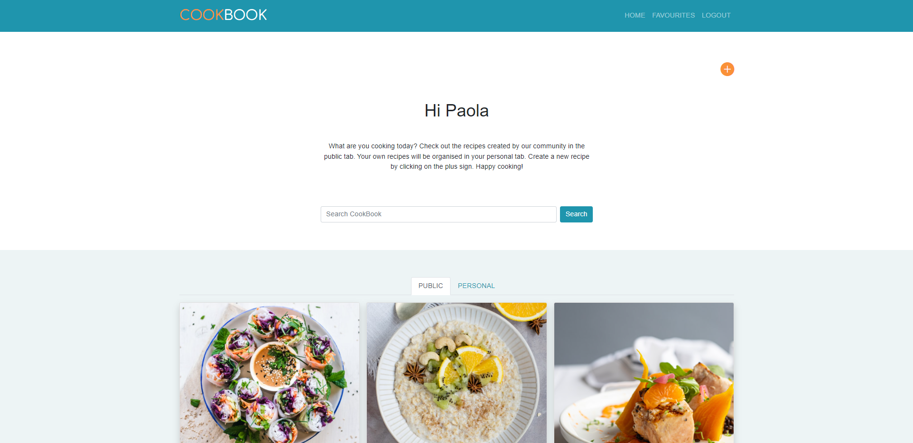

# CookBook - Testing Details

[Main README.md file](README.md)

[Deployed site](https://paolas-cookbook.herokuapp.com/)

The following validators were used to check the validity of the website code:

[W3C Makup Validation Service](https://validator.w3.org/)

[W3C CSS Valiation Service](http://jigsaw.w3.org/css-validator/)

[JSHint](https://jshint.com/)

[PEP8online](http://pep8online.com/)

There are no errors for both CSS and HTML. I have a warning for HTML for a missing header for a section, but I believe that the header is not needed in that specific scenario. JSHint is returning warnings for my JavaScript as I have included Jinja template language in it. I do get errors for Python for one only reason: "line too long". I left those not to break the code. 

## User Stories Testing 

User stories can be found in the UX section in the [README.md file](README.md)

1. As an Admin User I want to be able to add new recipe categories so that Site Users can better organise their recipes.

    i. Admin users are able to add new categories throught the admin panel, "Main" section, "Categories". Currently there are 12 categories.

    ii. Admin users can filter the available categories by created_on or updated_on dates. 

    iii. Admin users can search the available categories by name.

2. As an Admin User I can delete recipe posts so that I can manage the site content and make sure it is appropriate.

    i. Admin users have access to all recipes via the admin panel, "Main" section, "Recipes". 

    ii. Admin users can view the whole content of a recipe on the same page, as I have included Ingredients and Steps inlines. 

    iii. Admin users can filter the existing recipes by created_on or updated_on dates.

    iv. Admin users can search the available recipes via title and author. 

    v. Admin users can delete recipes where content is not appropriate. 

3. As an Admin User I can delete comments so that inappropriate comments can be removed.

    i. Admin users have access to all comments via the admin panel, "Main" section, "Comments".

    ii. Admin users can filter the existing comments by created_on date.

    iii. Admin users can search the available recipes via recipe and author.

    iv. Admin users can delete comments where content is not appropriate. 

4. As a Site User I want to be able to have recipes organised in different categories so that I can find what I am looking for more easily.  

    i. Existing recipes are organised by different categories. 

    ii. Users are presented with all the categories in the home page and they can select the category they wish to find recipes for. 

    iii. By clicking on a category, users are redirected to a new page listing all the available recipes for that category.

5. As a Site User I want to be able to view a list of recipes so that I can select which one to open and view.

    i. By clicking on a food category, located in the home page, the user is redirected to a new page listing all the available recipes for that category. 

6. As a Site User I want to be able to open a specific recipe so that I can view the details, such as ingredients and intructions.

    i. Users can click on a recipe in the list of available recipes to open it and view the details.

    ii. Users will be able to view the recipe details: title, author, creation date ingredients, steps, image, servings. 

7. As a Site User I want to be able to view the likes of a recipe post so that I can see which recipes are more popular.

    i. On the recipe_detail page, users will be able to view the number of likes for the recipe they are viewing.

    ii. The number of likes is located just above the comments, next to a heart icon.

8. As a Site User I want to be able to view the comments of a recipe post so that I can see the conversation.

    i. On the recipe_detail page, users will be able to view the comments left by authenticated users. 

    ii. Comments are listed from the most recent on top to the older ones. This is personal preference, they can easily be changed to have the oldest comment on top. 

    iii. Users can view the number of comments, this is located just above the comments, next to a speech bubble icon.

9. As a Site / Admin User I want to be able to search for a recipe so that I can easily find it. 

    i. Admin users can search for recipes as described in user story 2, point iv.

    ii. Site users have a search bar located in different pages that allows them to search for existing recipes.

    iii. Non authenticated users will be able search all the recipes made public by registered users.

    iv. uthenticated users will be able to search all recipes made public by other creators and also their own personal recipes (private and public). 

10. As a Site User I want to be able to log into my account so that I can see both the public recipes shared by the community and my own personal recipes. 

    i. The website has an authentication process so that users can register for an account, login and logout.

    ii. Authenticated users will have access to all the website features, including creating and updating recipes, leaving likes and comments, adding other crators' recipes to their favourites. 

11. As a Site User I can create a new recipe post so that it is added to my personal recipes.

    i. Authenticated users can click on the plus sign icon, located in different pages, to create a new recipe.

    ii. When clicking on the icon, users are redirected to the create_recipe page where they are presented with a form to collect all the recipe details.

    iii. When the recipe is created by clicking on the "submit" button, it will be visible on the user personal_recipes page, and also the public_recipes page if the user checked the "public" option while filing the form. 

12. As a Site User I can edit or delete my recipe posts so that I can manage my own content.  

    i. Authenticated users can delete their recipes. On the recipe_detail page, there is a bin icon located on the top right corner of the page. 

    ii. By clicking on the icon, users are redirected to the delete_recipe page where they are asked to confirm that they want to delete the recipe. 

    iii. Authenticated users can edit their recipes. On the recipe_detail page there is a pencil and paper icon on the top right corner of the page.

    iv. By clicking on the icon, users are redirected on the update_recipe page, where they are presented with a pre-filled form containing the recipe details. 

    v. Users can update their recipe by clicking on submit. 

13. As a Site User I can make my recipe posts public so that they are shared with the community and can be viewed by other users.

    i. Authenticated users can make their recipe public by cliking on the "public" checkbox while filling the form when creating the recipe. 

    ii. Users can also make their recipe public when updating a recipe, by clicking on the "public" checkbox.

14. As a Site User I want to be able to leave comments on a recipe post so that I can be part of the conversation.

    i. Auhenticated users will be able to see a comment form on the recipe_detail page.

    ii. By filling the form and clicking on "submit", the comment will be saved and shown in the comments section below the recipe. 

15. As a Site user I want to be able to like/unlike a recipe so that I can interact with the shared content. 

    i. Authenticated users can like/unlike a recipe post by clicking on the heart icon located on the top right corner of the recipe_deail page. 

    ii. Creators will not be able to like/unlike their own recipes. 

16. As a Site User I want to be able to save a recipe I like into my favourites section so that I can have easy access to it.

    i. Authenticated users have access to a favourites page where they can view the recipes from other creators they saved as favourites.

    ii. To add a recipe to the favourites, users can click on the star icon located on the top right corner of the recipe_detail page. This option is only available to save other creators' recipes and not their own.

    iii. To remove the recipe from their favourites, users can simply click on the star icon again. 

## Manual Testing 

### Home Page 

1. Header and Authentication

    - Click on the website logo and verify that it redirects to the home page.

    - For non authenticated users, verify that the navigation menu contains the following options: "home", "login", "register".

    - Click on "home" and verify that it redirects to the home page.

    - Click on "login" and verify that you are redirected to the login page. Enter your credentials and verify that it redirects you to the home page and that a success message appears on top of the page (message will disappear after 3 seconds). 

    - Try to log in without the required credentials and verify that a message appears asking to fill in the required fields. Try to login with incorrect credentials and veryfy that a message appears to inform that the username and/or password are incorrect.

    - On the login window, click on the "sign-up" link and veryfy that it redirects to the signup page.

    - Click on "register" on the header navigation bar and verify that it redirects you to the signup page. Enter the required details and click on sign-up, veryfy that you are redirected to the home page and that a success message appears on top of the page (message will disappear after 3 seconds).

    - Try to register without filling the required details and verify that a message appears asking to fill in the required fields. Try to register without filling the optional field and verify that you are able to proceed successfully.

    - For authenticated users, verify that the following options are shown in the navigation menu: "home", "favourites", "logout".

    - Click on "home" when authenticated and verify that it redirects you to the home page. 

    - Click on "favourites" and verify that it redirects you to the favourites page.

    - Click on "logout" and verify that you are redirected to the logout page. 

    - In the logout page, verify that you are asked to confirm that you want to logout. Click on the "sign out" button and verify that you are redirected to the home page and a success message appears on top of the page (message will disappear after 3 seconds).

2. Welcome section 

    - For non authenticated users, verify that a welcome message is shown with a short introduction of the website. Call to action is specific for non authenticated users, it advises to create an account to have access to additional features.

    - For authenticated users verify that the title now is different and contains a greeting for the user. Call to action is also different and invites the user to create a new recipe by clicking on the plus sign icon. 

    - For authenticated users verify that a plus sign icon is present on the top right corner of the page. Hover over the icon and verify that it changes colour. Click on the icon and verify that you are redirected to the create_recipe page. 

    - Below the welcome message there is a search bar. For both authenticated and non authenticated users, fill in the search field click on the "search" button, verify that you are redirected to the search_results page. Click on "search" without filling in the field and verify that a message appears asking to fill in the required field. Hover over the "search" button and verify that it changes colour. 

3. Food category cards 

    - For non authenticated users, verify that the 12 available food categories are listed and shown in a grid or cards. Hover over the card text section and verify that it changes colour.  

    - For non authenticated users, click on each category card and verify that you are redirected to the public_recipes page for that specific category (for example: /public/appetizers). 

    - For authenticated users, verify that you have a small navigation menu in the category cards section. Options are: "public" and "personal". Switch beween the two options and verify that all 12 categories are shown for eatch option. Hover over the  text section on the cards and verify that it changes colour.

    - For authenticated users, click on each category card in the "public" section and verify that you are redirected to the public_recipes page for that specific category (for example: /public/appetizers).

    - For authenticated users, click on each category card in the "personal" section and verify that you are redirected to the personal_recipes page for that specific category (for example: /personal/breakfast).

4. Footer 

    - In the footer, there are 4 social media icons. Hover over each icon and verify that it changes colour. 

    - Click on each social media icon and verify that you are redirected to the correct social media page. 

    - Below the social media links, verify that the copyright info is showing correctly (correct year).

#### Home Page (finished site)

### Public Recipes Page

1. Header and Authentication

    - Steps are highlighted in the manual testing of the Home Page section.

2. Top section 

    - For both authenticated and non authenticated users, verify that the top section of the page contains a title that reflects the food category the user has clicked on when in the home page. Right below the title, there is a short sentence also containing the food category name, verify that this is correct. 

    - Below the title and sentence, there is the search bar we saw also in the home page. Follow the same steps highlighted in the manual testing for the home page. 

    - For authenticated users verify that a plus sign icon is present on the top right corner of the page. Hover over the icon and verify that it changes colour. Click on the icon and verify that you are redirected to the create_recipe page.

3. Recipe cards 

    - For both authenticated and non authenticatd users, verify that if recipes are present, a list of cards is shown and organised into a grid. Hover over the text section on the cards and verify that it changes colour. Click on the cards and verify that you are redirected to the recipe_detail page for that specific recipe. 

    - If no recipes are present for the selected category, verify that a message is shown to inform the user. 

4. Footer 

    - Steps are highlighted in the manual testing of the Home Page section.

#### Public Recipes Page (finished site)

### Personal Recipes Page

1. Header and Authentication

    - Steps are highlighted in the manual testing of the Home Page section.

    - Only authenticated users have access to this page. As a non authenticated user, try to navitage to any personal_recipes url (as example /personal/appetizers) and verify that you are redirected to the home page and a warning message appears (message will disappear after 3 seconds).

2. Top section 

    - Verify that the top section of the page contains a title that reflects the food category the user has clicked on when in the home page. Right below the title, there is a short sentence also containing the food category name, verify that this is correct. 

    - Below the title and sentence, there is the search bar we saw also in the home page. Follow the same steps highlighted in the manual testing for the home page. 

    - Verify that a plus sign icon is present on the top right corner of the page. Hover over the icon and verify that it changes colour. Click on the icon and verify that you are redirected to the create_recipe page.

3. Recipe cards

    - Verify that if recipes are present, a list of cards is shown and organised into a grid. Hover over the text section on the cards and verify that it changes colour. Click on the cards and verify that you are redirected to the recipe_detail page for that specific recipe. 

    - If no recipes are present for the selected category, verify that a message is shown to inform the user.

4. Footer 

    - Steps are highlighted in the manual testing of the Home Page section.

#### Personal Recipes Page (finished site)

### Recipe Detail Page

### Create Recipe Page

### Update Recipe Page

### Delete Recipe Page

### Favourites Page

### Search Results Page